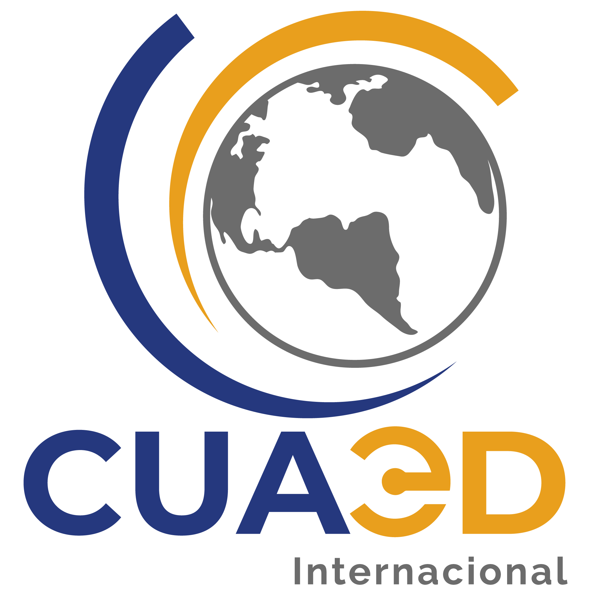

# CUAED Internacional

La oficina de internacionalización de la CUAED se dedica a fortalecer la cooperación global mediante cursos COIL, promover la movilidad estudiantil y crear una red de docentes expertos del SUAyED. Su misión es vincular proyectos educativos con instituciones internacionales, enriqueciendo la experiencia académica y expandiendo las oportunidades para la comunidad universitaria.